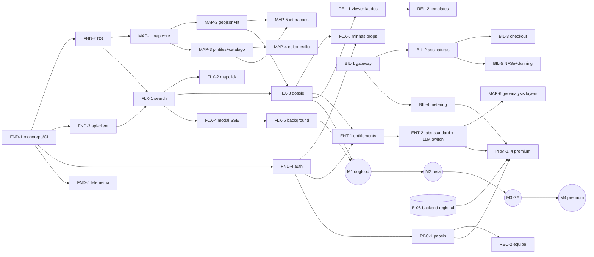

# Roadmap Executável — Plataforma SaaS GreenNexus

> Versão 1.0 — 2026-06-12 · Companion de `plataforma-saas.md`
> Convenções: tamanho **P** (≤1 semana·dev) / **M** (2–3) / **G** (4+); colunas listam **predecessoras** (não inicia sem), **sucessoras diretas** (o que esta atividade libera) e **paralela com** (pode correr junto). IDs `B-xx` referem-se às dependências de backend (`plataforma-saas.md` §12).

## 1. Marcos

| Marco | Definição de pronto | Conteúdo |
|---|---|---|
| **M0 — Fundação** | CI verde + app esqueleto autenticado deployado em dev | trilha FND completa |
| **M1 — MVP interno (dogfood)** | Fluxo central completo com tier Básico, sem billing, uso interno | FND + MAP-1..4 + FLX-1..5 |
| **M2 — Beta fechado (Básico)** | 3–5 tenants convidados; RBAC mínimo; cobrança manual/contrato | M1 + RBC-1..2 + ENT-1..2 + REL-1 + HRD-1 |
| **M3 — GA Básico + Standard** | Self-service completo: signup, pagamento, NFS-e, admin interno operante | M2 + BIL-* + ADM-1..3 + ENT-3 + MAP-5..6 + FLX-6 |
| **M4 — Premium (cadeia dominial)** | Cotação dinâmica + execução + cobrança por uso | M3 + **B-06 backend** + PRM-* |
| **M5 — Expansões** | Monitoramento, API pública/MCP B2B, comparador temporal | pós-GA |

## 2. Trilhas e atividades

### FND — Fundação (sequencial no início, depois libera tudo)

| ID | Atividade | Tam. | Pred. | Libera | Paralela com |
|---|---|---|---|---|---|
| FND-1 | Monorepo (pnpm+Turborepo), apps/web + apps/admin esqueleto, CI/CD (build, lint, test, preview por PR), deploy SWA/CDN | M | — | todas | — |
| FND-2 | Design system: tokens GN, tema dark/light, shadcn/ui base, tipografia, ícones, layout shell (sidebar/topbar) | M | FND-1 | todas de UI | FND-3, FND-4 |
| FND-3 | `packages/api-client` + `packages/schemas` (Zod espelhando gn-schemas) + mocks (MSW) p/ dev desacoplado | M | FND-1 | FLX-*, ENT-* | FND-2, FND-4 |
| FND-4 | Auth no front (login, sessão httpOnly via BFF, guards de rota) — **depende B-01 mínimo** | M | FND-1, B-01 | RBC-*, tudo autenticado | FND-2, FND-3 |
| FND-5 | Telemetria base (OTel web, sourcemaps, funil de produto) | P | FND-1 | HRD-2 | qualquer |

### MAP — Mapa core

| ID | Atividade | Tam. | Pred. | Libera | Paralela com |
|---|---|---|---|---|---|
| MAP-1 | `packages/map`: wrapper MapLibre, protocolo pmtiles, basemap próprio, controles padrão | M | FND-2 | MAP-2..6, FLX-3 | FND-3..5 |
| MAP-2 | Render GeoJSON do snapshot + **fit-bounds animado** + highlight de entrada + multi-unidade | M | MAP-1, FND-3 | FLX-3 | MAP-3 |
| MAP-3 | Camadas PMTiles nacionais via **catálogo servido** (B-05) — liga/desliga, opacidade, legenda | M | MAP-1, B-05 | MAP-4 | MAP-2 |
| MAP-4 | **Editor de estilo por camada** (cor, espessura, line-dasharray, transparência, cor por atributo) + presets por usuário/tenant | G | MAP-3 | — (feature standalone) | FLX-4..5 |
| MAP-5 | Interações: hover/clique→ficha do feature, medição, tooltip configurável | M | MAP-2, MAP-3 | FLX-6 | MAP-4 |
| MAP-6 | Camadas do geoanalysis (COG/heatmaps/contours via deck.gl) + timeline temporal | G | MAP-1, ENT-2 | — | REL-2 |

### FLX — Fluxo central (pesquisa → processamento → dossiê)

| ID | Atividade | Tam. | Pred. | Libera | Paralela com |
|---|---|---|---|---|---|
| FLX-1 | UnifiedSearchBar (detecção CAR/SIGEF/coords/CPF-CNPJ, Zod, sugestões, histórico) | M | FND-2, FND-3 | FLX-2 | MAP-1..2 |
| FLX-2 | **Mapclick**: camada nacional de imóveis + identificação point-in-polygon + card de confirmação | M | MAP-2, MAP-3, FLX-1 | FLX-3 | FLX-4 |
| FLX-3 | Dossiê da propriedade: layout 3 zonas, tabs dos domínios Básicos, deep-link de estado | G | MAP-2, FLX-1, FND-3 | FLX-4..6, ENT-1, REL-1 | MAP-3..4 |
| FLX-4 | **Modal de processamento** SSE: stepper por domínio, reconexão, falha parcial com retry | M | FND-3, FLX-1 | FLX-5 | FLX-3 |
| FLX-5 | Modo background + **Central de processamentos** (fila viva, histórico, notificação e-mail) | M | FLX-4 | — | FLX-3, MAP-4 |
| FLX-6 | Minhas propriedades + dashboard do tenant (KPIs, favoritos, tags) | M | FLX-3, FND-4 | — | REL-1, ENT-* |

### ENT — Tiers & entitlements

| ID | Atividade | Tam. | Pred. | Libera | Paralela com |
|---|---|---|---|---|---|
| ENT-1 | Entitlements no front: gates por plano, estados "bloqueado por plano" com upsell desenhado | M | FLX-3, FND-4, B-01 | ENT-2..3, BIL-3 | RBC-1 |
| ENT-2 | Tabs Standard (Laudo IA, Legal, Geoanalysis, Clima) + **switch LLM FAST→HIGH** com custo exibido (contrato ADR-PLAT-029 pronto) | G | ENT-1, FLX-3 | MAP-6, REL-2 | BIL-1..2 |
| ENT-3 | Quotas visíveis (consumo vs plano) + bloqueios suaves de excedente | P | ENT-1, BIL-2 | — | ADM-2 |

### RBC — RBAC & equipe

| ID | Atividade | Tam. | Pred. | Libera | Paralela com |
|---|---|---|---|---|---|
| RBC-1 | Papéis no front (owner/admin/analyst/viewer/billing), guards por permissão — **depende B-04** | M | FND-4, B-04 | RBC-2, BIL-4 | ENT-1 |
| RBC-2 | Gestão de equipe: convites por e-mail, troca de papel, remoção, auditoria visível | M | RBC-1 | — | BIL-*, ADM-1 |

### BIL — Billing & pagamento

| ID | Atividade | Tam. | Pred. | Libera | Paralela com |
|---|---|---|---|---|---|
| BIL-1 | Interface `PaymentProvider` no BFF + decisão de gateway (Stripe vs nacional) + sandbox — **B-02** | M | B-02 | BIL-2..5 | ENT-2, RBC-* |
| BIL-2 | Assinaturas: planos, ciclo, upgrade/downgrade com pró-rata, trial | G | BIL-1 | ENT-3, BIL-3 | ADM-2 |
| BIL-3 | Checkout self-service + métodos de pagamento + página Plano & Faturamento | M | BIL-2, ENT-1 | — | BIL-4 |
| BIL-4 | Metering de uso (eventos B-07) + invoice items (HIGH LLM, excedentes) | M | BIL-1, B-07 | PRM-3, ENT-3 | BIL-3 |
| BIL-5 | NFS-e (eNotas/NFE.io) + dunning (retentativa, suspensão suave) | M | BIL-2 | — | ADM-4 |

### ADM — Administração interna (apps/admin)

| ID | Atividade | Tam. | Pred. | Libera | Paralela com |
|---|---|---|---|---|---|
| ADM-1 | Shell do admin + RBAC interno (support/ops/finance/superadmin) + busca global tenant/run | M | FND-2, FND-4 | ADM-2..5 | FLX-*, BIL-* |
| ADM-2 | Tenants & assinaturas: CRUD, plano, quotas, flags por tenant, suspensão, impersonation auditada | M | ADM-1, BIL-2 | — | ADM-3 |
| ADM-3 | Operações: runs cross-tenant, retry, painel freshness das fontes (control tables DETL), status integrações | M | ADM-1 | — | ADM-2, ADM-4 |
| ADM-4 | Financeiro: faturas, inadimplência, créditos/reembolso, margem por tenant | M | ADM-1, BIL-4..5 | — | ADM-3 |
| ADM-5 | Catálogo de produto: preços versionados com vigência (plano, matrícula, LLM) | M | ADM-1 | PRM-1 | ADM-2..4 |

### REL — Relatórios

| ID | Atividade | Tam. | Pred. | Libera | Paralela com |
|---|---|---|---|---|---|
| REL-1 | Viewer de laudos (report-portal), export PDF, compartilhamento com expiração | M | FLX-3 | REL-2 | ENT-*, BIL-* |
| REL-2 | Templates por plano (report-design) + laudo Standard com seções IA/geo/clima | M | REL-1, ENT-2 | — | MAP-6 |

### PRM — Premium (cadeia dominial) — **gate: backend B-06 (Onda 3) entregue**

| ID | Atividade | Tam. | Pred. | Libera | Paralela com |
|---|---|---|---|---|---|
| PRM-1 | Motor de cotação no front: detecção de matrículas do snapshot, simulação (n × preço + LLM), tela de orçamento — **B-03, ADM-5** | M | ENT-2, B-03, ADM-5 | PRM-2 | — |
| PRM-2 | Workflow de aprovação (papel `billing.approve`, limites por tenant) + aceite auditado vinculado ao quote | M | PRM-1, RBC-1 | PRM-3 | — |
| PRM-3 | Execução + acompanhamento (modal reusa FLX-4) + cobrança por uso (BIL-4) + falha parcial com crédito | M | PRM-2, BIL-4, B-06 | PRM-4 | — |
| PRM-4 | Visualização: grafo da cadeia dominial, linha do tempo de ônus/averbações, tab Registral no dossiê | G | PRM-3 | — | — |

### HRD — Hardening & lançamento

| ID | Atividade | Tam. | Pred. | Libera | Paralela com |
|---|---|---|---|---|---|
| HRD-1 | E2E Playwright do fluxo central (smoke de CI), estados de erro/vazio, acessibilidade AA | M | FLX-1..5 | M2 | REL-1 |
| HRD-2 | Performance (budgets, code-split do mapa, virtualização) + funil analytics validado | M | M1, FND-5 | M3 | HRD-1 |
| HRD-3 | Segurança: pentest leve, CSP, revisão LGPD (consentimento/export/erasure) | M | M2 | M3 | HRD-2 |

## 3. Grafo de dependências (visão macro)

## 4. Caminho crítico e paralelismo

**Caminho crítico até GA (M3):**
`FND-1 → FND-2 → MAP-1 → MAP-2 → FLX-3 → ENT-1 → ENT-2 → (BIL-2 → BIL-3) → M3`

**Maximização de paralelismo por fase:**
- Fase A (pós-FND): 3 frentes simultâneas — *Mapa* (MAP-1..3), *Fluxo* (FLX-1, FLX-4) e *Plataforma* (FND-4/B-01, RBC-1/B-04).
- Fase B (pós-M1): *Billing* (BIL-1..5) corre 100% paralela a *Standard* (ENT-2, MAP-6, REL-2) e a *Admin* (ADM-1..5) — três squads sem colisão de código (apps/pacotes distintos).
- **Backend como sombra**: B-01/B-04/B-05 precisam estar prontos antes da Fase A terminar; B-02/B-03/B-07 antes da Fase B; **B-06 (registral) é o único gate do M4** — se atrasar, M4 desliza sem afetar M3.

**Riscos de cronograma (top 3):** (1) B-06 registral é trilha de backend inteira (ONR+extração) — iniciar em paralelo desde já; (2) decisão de gateway de pagamento trava BIL-* — decidir até o fim da Fase A; (3) editor de estilo (MAP-4) é o maior G de UI — não está no caminho crítico, pode deslizar para pós-M2 sem dor.

## 5. Definition of Done transversal

Toda atividade: testes (unit + e2e quando toca fluxo central), telemetria dos eventos novos, i18n das strings, estados vazio/erro/carregando desenhados, revisão de acessibilidade, flag de rollout quando tocar fluxo existente.
